Non-parametric and Semi-parametric models in R
========================================================
author: Soroor Hediyehzadeh - Walter and Eliza Hall Institute of Medical Research
date: December 2018
autosize: true

About #rstats lunch seminars
========================================================

- 45 - 50 minutes online sessions via Zoom
- Aims to enhance the statistical knowledge and expertise of the RLadies community
- Topics include statistical and statistical learning models

Recent achievements of RLadies Melbourne Members
========================================================
**Congradulations!**
- To **Earo Wang** for 2018 ASA Statistical Graphics Student Paper Award
- And to our very own **Alexandra Garnham** for 2018 ABACBS Professional Bioinformatician Award

Non-parametric vs Parametric models
========================================================

- Strong distributional assumptions behind parametric models >> less flexibility
- No assumptions about distribution of the data in non-parametric modelling. Models are more flexible, and more complex.
- Parametric models are generalizable, while non-parametric models are not
-    >> Bias - variance trade-off: parametric estimates have smaller variance and large bias,
        non-parametric models have small bias, but large variance
        
Non-parametric Estimation
========================================================

- Non-parametric Density Estimation : 
	- Histogram
	- Kernel Density Estimation
- Non-parametric Regression : 
	- Nadyara-Watson estimator
	- Local Polynomial estimators
	- splines

Non-parametric Density Estimation
========================================================
- Histogram 
- Kernel Density Estimation (KDE)

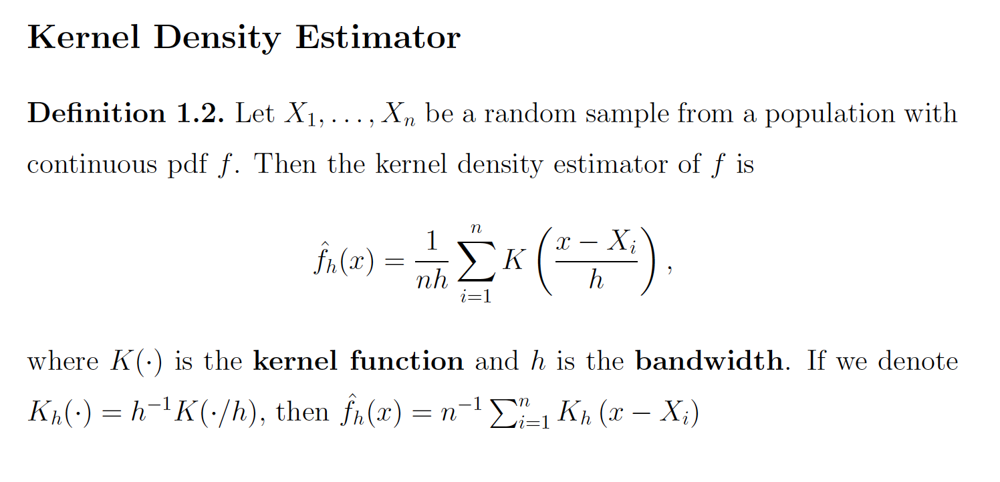

Kernel Density Estimation
========================================================
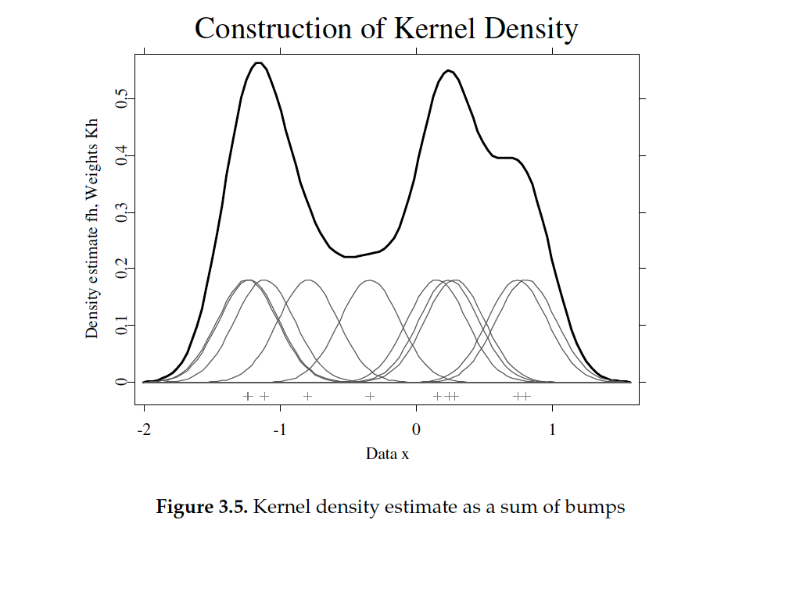

KDE - choices for kernels
==========
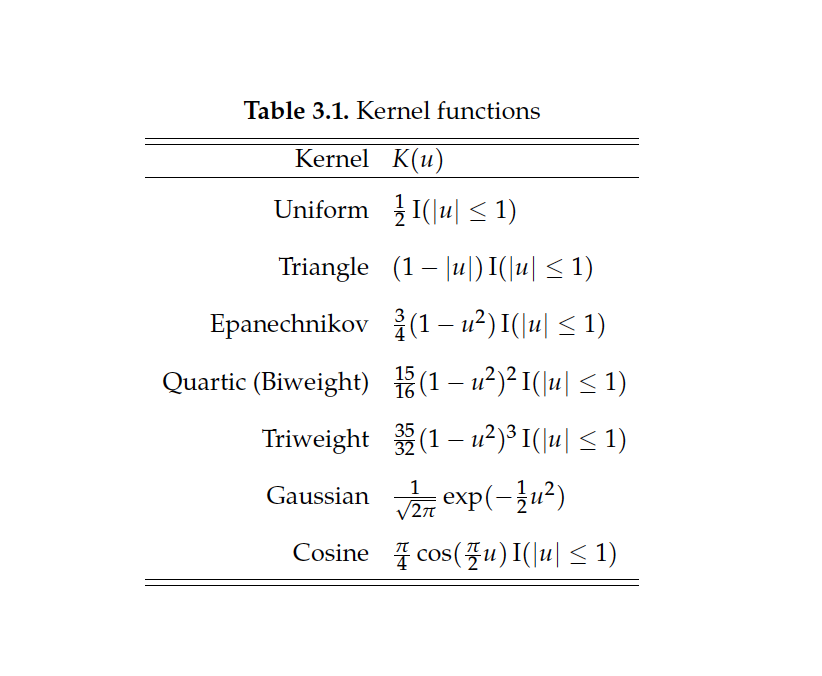

Non-parametric Regression
========================================================
Typically used for trend estimation. Models conditional expectation of the response

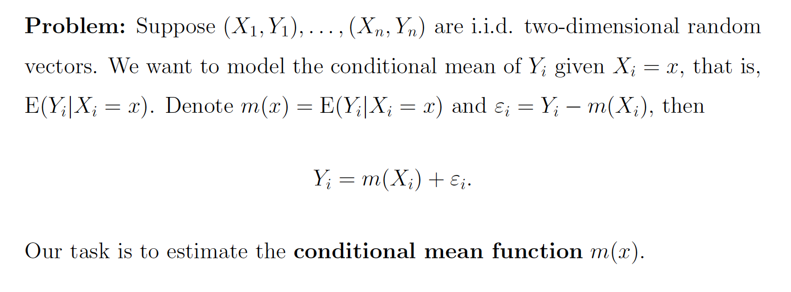

N-W estimator (local constant regression)
=======================

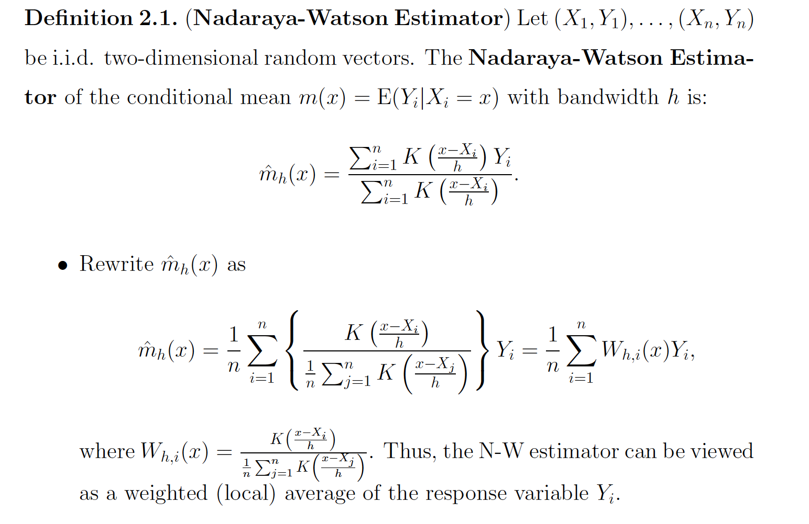

N-W estimator
======================
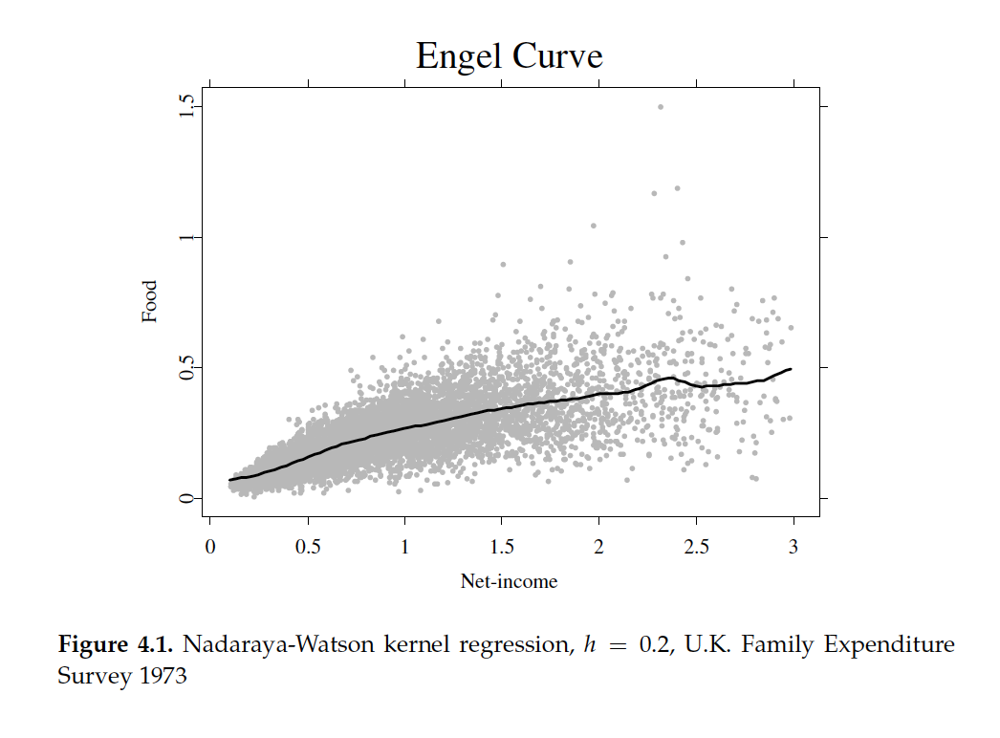

Local Polynomial Regression
======================

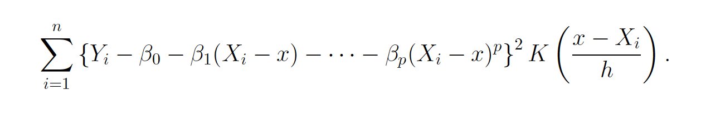

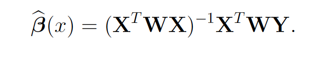

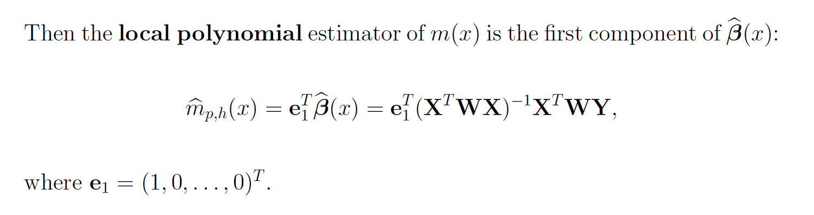


Splines
======================
- splines: Fix a number of data points. These points are called **knots**. Then, fit piecewise polynomials between knots. Typically local polynomial order 4 is used, which are called cubic splines.

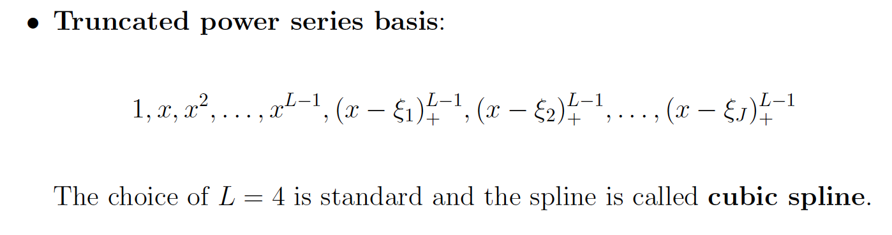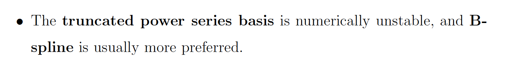

*In the above expressions, epsilons are  __knots__*

Splines
========================

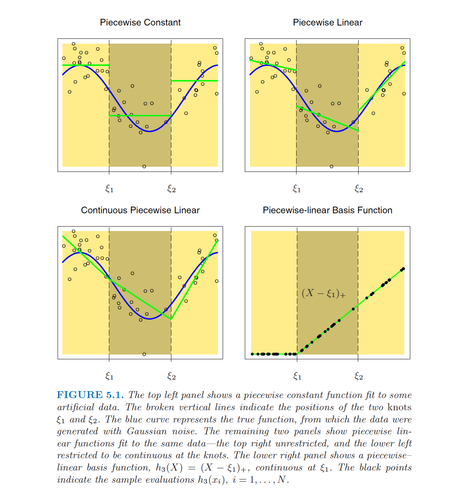

Smoothing Splines
================================

- Avoid selection of Knots
  * All distinct data points are taken as knots
- Have control on the curvature (i.e. smoothness) of the fit

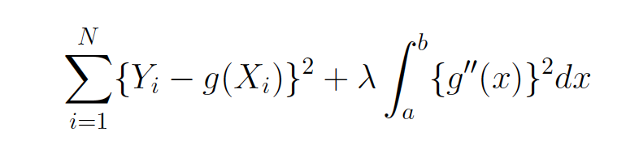


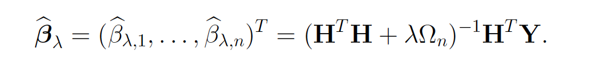


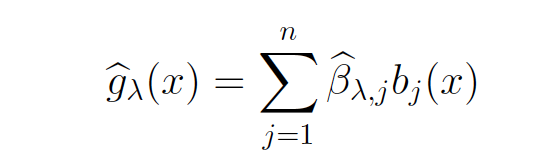

Semi-parametric models
========================================================
- Non-parametric models require estimation of a large number of parameters, resulting in very complex models >> **curse of dimensionality**

- Use a combination of parametric and non-parametric models to avoid estimation of large # of parameters >> **semi-parametric models**

Semi-parametric models include:
=========================
* Additive Models 
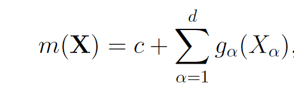
* Partial linear models   
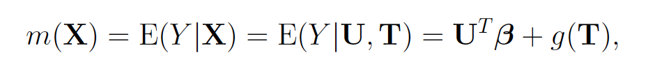

* Generalized Partial Linear models
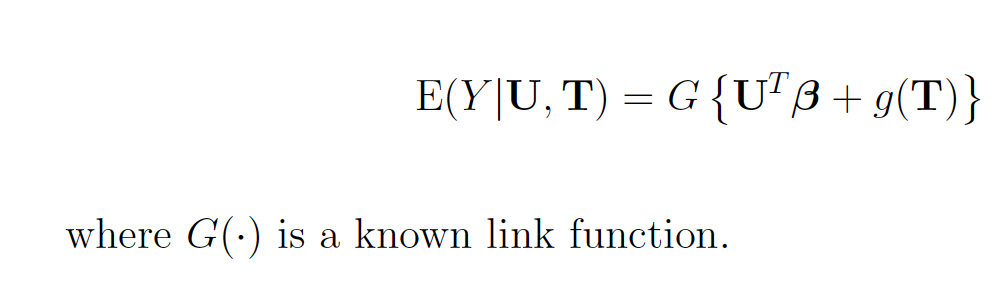

* Generalized additive model
* Single Index model - link function unknown

Parkinson's Telemonitoring Dataset
===================
- Response variables:
 * motor_UPDRS
 * total_UPDRS
- Covariates:
 * NHR,HNR
 * RPDE - A nonlinear dynamical complexity measure
 * DFA - Signal fractal scaling exponent
 * PPE - A nonlinear measure of fundamental frequency variation
 * Jitter(Abs)
 * Shimmer
 
Parkinson's Telemonitoring Dataset
===================

* 2-D KDE


```r
# Generate 2-d density plots
contour(kde2d(Upd_avg[,param], Upd_avg$total_UPDRS, n=100),
				xlab = param, ylab = "total_UPDRS")
```

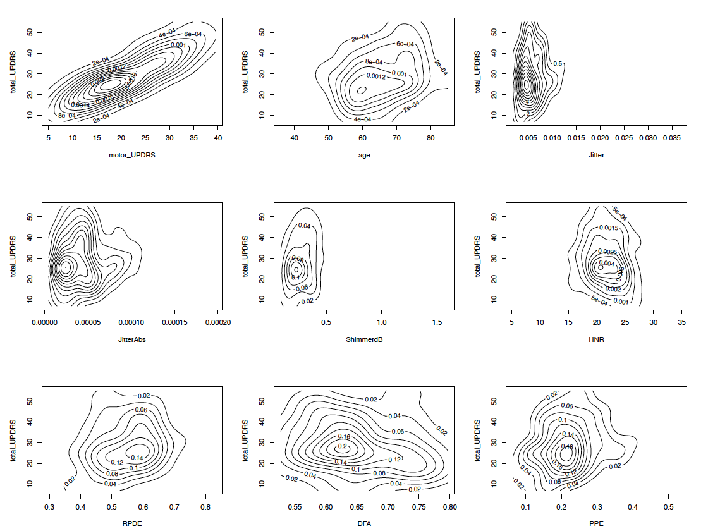

Parkinson's Telemonitoring Dataset
===================
* Kernel regression

```r
plot(ksmooth(x, y, kernel = "normal", bandwidth =bw))
points(x,y)
```

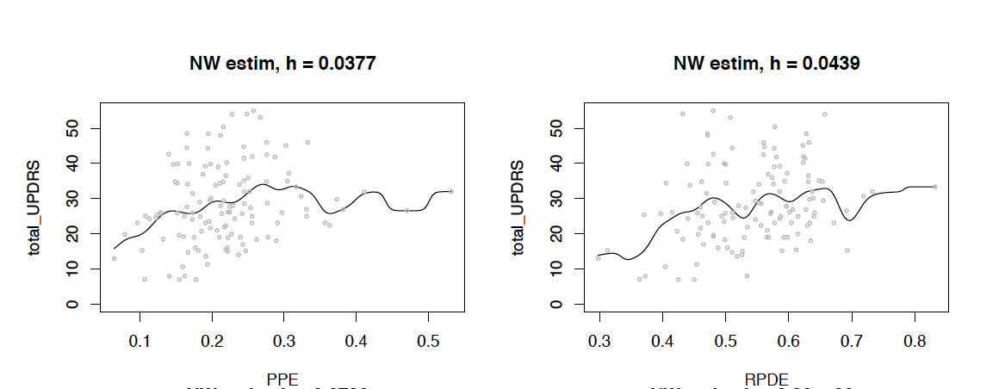


Parkinson's Telemonitoring Dataset
===================
__Fitting GAM (Generalized Additive Models) with the *mgcv* CRAN package__
* Recall that the covariates in the dataset are a combination of linear and non-linear covariates
* We use the `gam()` function to fit a Generalized Additive model with a Gaussian link function. The model consists of linear fit for linear covariates, and regression splines, denoted by `s()`, for non-linear terms. This is an extention to the Generalized Partial Linear model.

Parkinson's Telemonitoring Dataset
===================
__Fitting GAM (Generalized Additive Models) with the *mgcv* CRAN package__


```r
library(mgcv)
fit <- gam(motor_UPDRS ~ age + sex + Jitter + 
					 	JitterAbs + JitterRAP + 
					 	JitterDDP + Shimmer +
					 	ShimmerAPQ3 + 
					 	NHR + HNR + DFA + s(PPE) + s(RPDE)+
						s(subject,bs="re"), data = dat, method = "REML")
```
`s(, bs="re")` is a way to incorporate random effect terms to GAMs.


===================

```r
summary(fit)
```

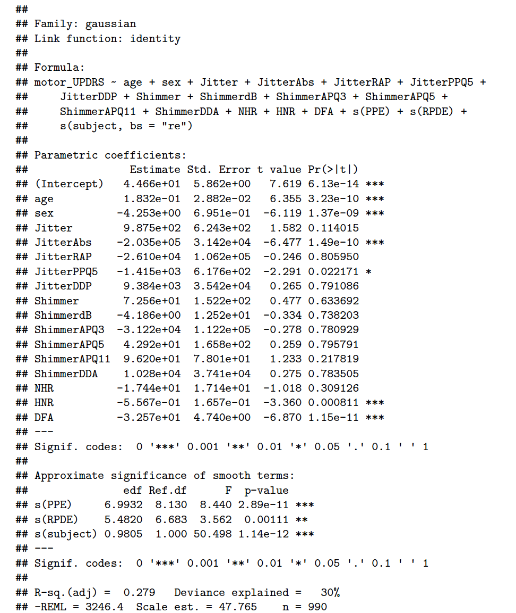


====================

```r
library(np)
fhat <- npcdens(motor_UPDRS~DFA,data=dat)
plot(fhat,view="fixed", theta = 310, phi=15,main="")
```

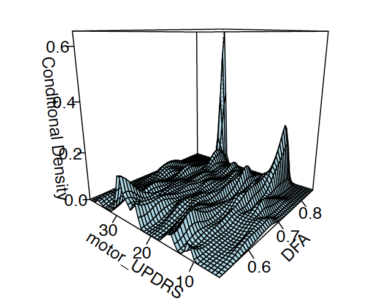

Modeling interactions with splines
=========================

Tests for interactions between non-linear terms is done using `te()`, the tensor product smooths


```r
fit <- gam(motor_UPDRS ~ age + sex + Jitter + 
					 	JitterAbs + JitterRAP + 
					 	JitterDDP + 
					 	NHR + HNR + DFA + s(PPE) + s(RPDE)+
						te(PPE, RPDE), data = dat, method = "REML")
```

Acknowledgments and resources
==============
Definitions and figures in this presentation are taken from Liuhua Peng's material. The Parkinson's Telemonitoring data analysis is a joint work of Gavriel Olshansky and myself.

__Suggested readings__

* Generalized Additive Models, Second Edition. Simon Wood.
* RACINE, J. NONPARAMETRIC AND SEMIPARAMETRIC METHODS IN R
* mgcv package vignette


Feedback time!
===================
R-Ladies Melbourne will soon undergo substantial structural changes. Your feedback helps the committee to decide if #rstats lunch seminars should have a place in the upcoming changes.

Link to the Google Survey : 

https://goo.gl/forms/YgWlrWZU8AlmajN82
